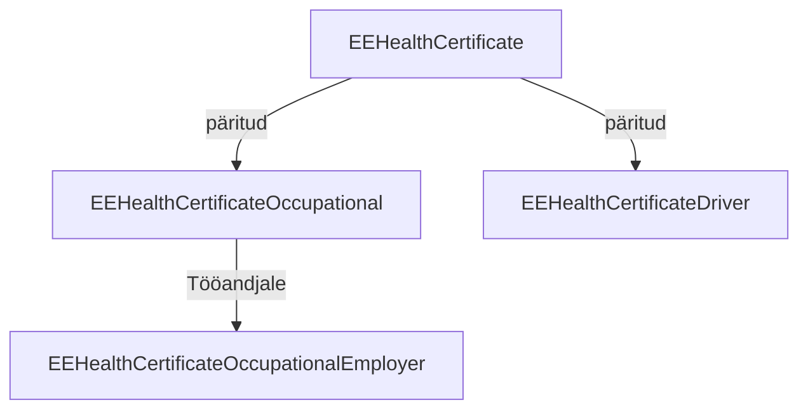

### Profiilide struktuur

Baasprofiil *[EEHealthCertificate](StructureDefinition-ee-health-certificate.html)* baseerub FHIR [Composition](https://hl7.org/fhir/composition.html) ressursil ja on päritud erinevate spetsiifilisemate
profiilide poolt.
Baasprofiil loetleb ühised reeglid ja määrab ressursi struktuuri kõikide sertifikaati tüüpide kohta.

### Töötervishoiu tervisetõend

*[EEHealthCertificateOccupational](StructureDefinition-ee-health-certificate-occupational.html)* on tervishoiu tervisetõendite baasprofiil. Mõeldud spetsialistidele (sh arstidele) ja töötajale andmete kuvamiseks.
Selle alamprofiil [EEHealthCertificateOccupationalEmployer](StructureDefinition-ee-health-certificate-occupational-employer.html)  on mõeldud tööandjale andmete väljastamiseks.

### Mootorsõidukijuhi tervisetõend
*[EEHealthCertificateDriver](StructureDefinition-ee-health-certificate-driver.html)* on mootorsõidukijuhi tervisetõendi profiil.
