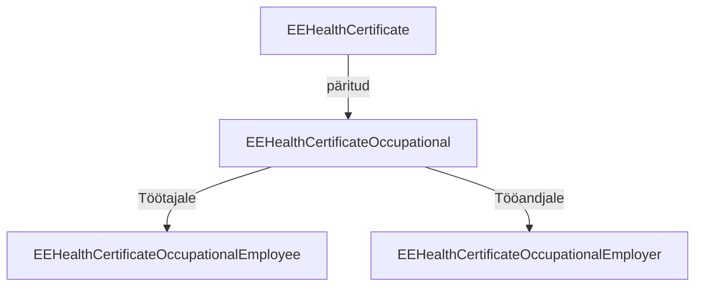

### Profiilide struktuur

Baasprofiil *[EEHealthCertificate](StructureDefinition-ee-health-certificate.html)* baseerub FHIR [Composition](https://hl7.org/fhir/composition.html) ressursil ja on päritud erinevate spetsiifilisemate
profiilide poolt.
Baasprofiil loetleb ühised reeglid ja määrab ressursi struktuuri kõikide sertifikaati tüüpide kohta.

Baasprofiiliga saab kirjeldada ka järgmised tõendid:
1. Mootorsõiduki juhtimise tõend
1. Relvaloa tervisetõend
1. Muud tervisetõendid

### Töötervishoiu tervisetõend

*[EEHealthCertificateOccupational](StructureDefinition-ee-health-certificate-occupational.html)* on tervishoiu tervisetõendite baasprofiil. Mõeldud spetsialistidele (sh arstidele) andmete kuvamiseks. Omakorda jaguneb kaheks profiiliks:

| Profiil                                                                                                         | Otstarbe                                             |
|-----------------------------------------------------------------------------------------------------------------|------------------------------------------------------|
| [EEHealthCertificateOccupationalEmployee](StructureDefinition-ee-health-certificate-occupational-employee.html) | Töötervishoiu tervisetõend töötajale väljastamiseks  |
| [EEHealthCertificateOccupationalEmployer](StructureDefinition-ee-health-certificate-occupational-employer.html) | Töötervishoiu tervisetõend tööandjale väljastamiseks |
